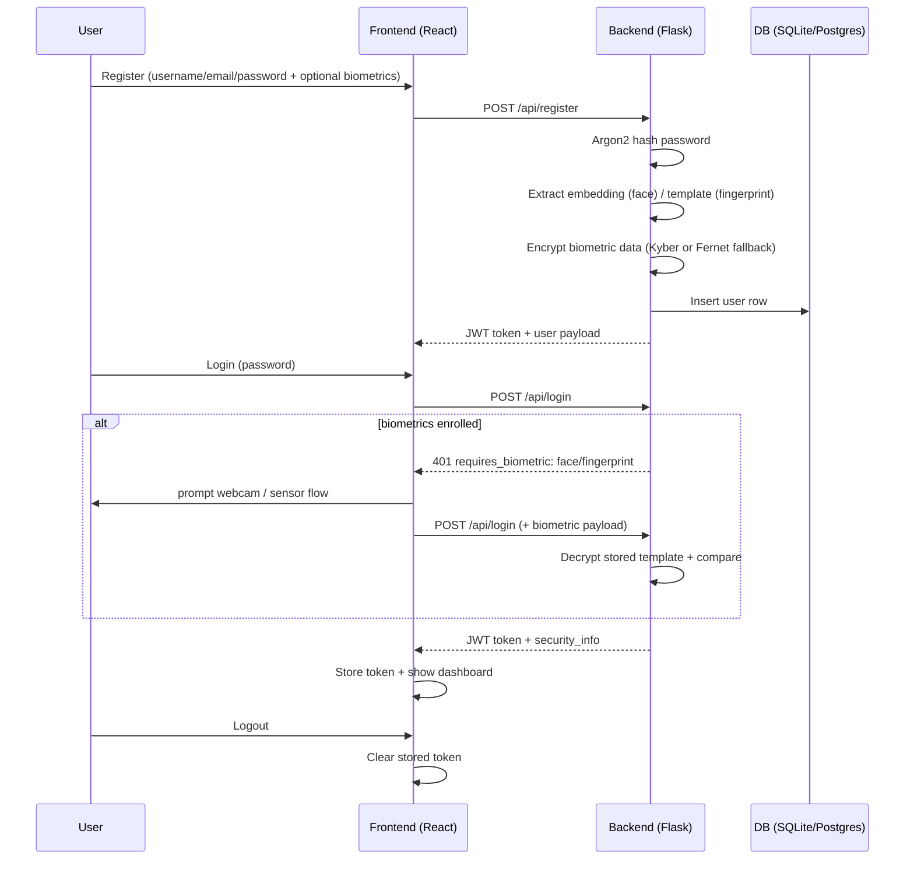
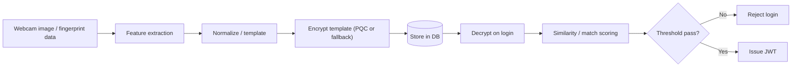

## Architecture (Quantum-Inspired Authentication)

### Overview

- **Frontend**: React (routes, auth context, webcam capture UX)
- **Backend**: Flask (JWT auth + biometric verification + PQC/QRNG status)
- **Storage**: SQLAlchemy models (users + WebAuthn credentials)
- **Security**: Argon2 password hashing, encrypted biometric templates, JWT sessions

### Auth flow (register → login → logout)

### Biometric enrollment & verification

### PQC / QRNG usage

- **PQC (Kyber KEM)**: used to protect encryption keys when available; otherwise fall back to Fernet.
- **QRNG**: ANU QRNG when available; otherwise use `secrets`-based fallback.
- **Why fallback exists**: to keep the demo runnable on typical machines while still demonstrating the architecture and decision points.

### Why these design choices (portfolio angle)

- **JWT**: straightforward stateless sessions; easy to demo with a dashboard and protected routes.
- **Argon2id**: modern password hashing best-practice.
- **Encrypted biometrics**: avoids storing raw biometric data; matches common privacy expectations.
- **Configurable thresholds**: demonstrates risk tuning and false accept/reject trade-offs.
