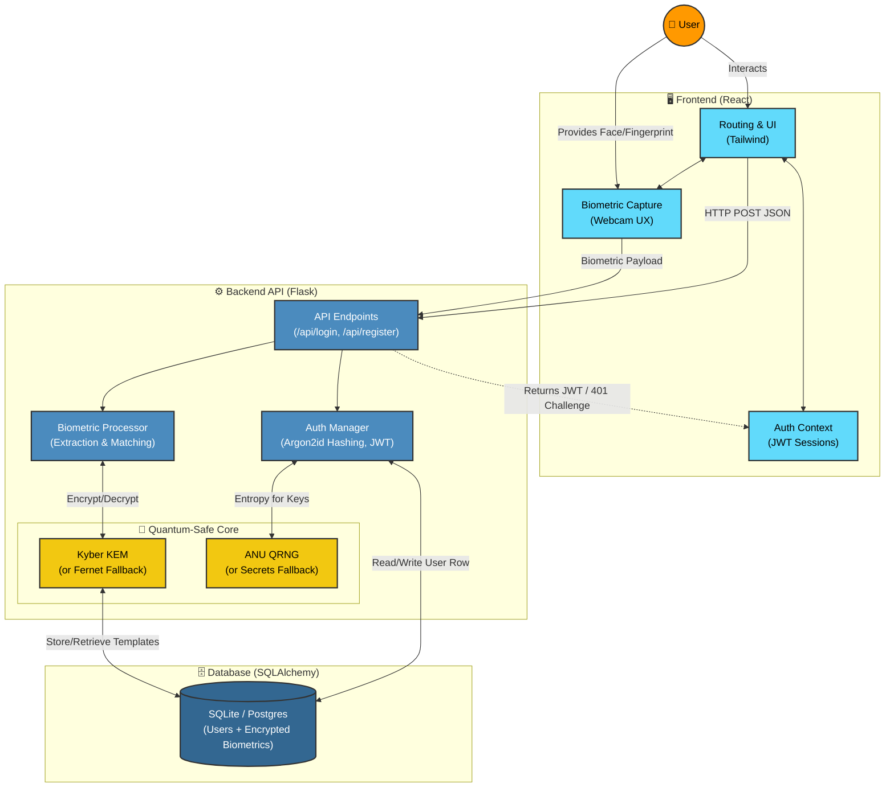
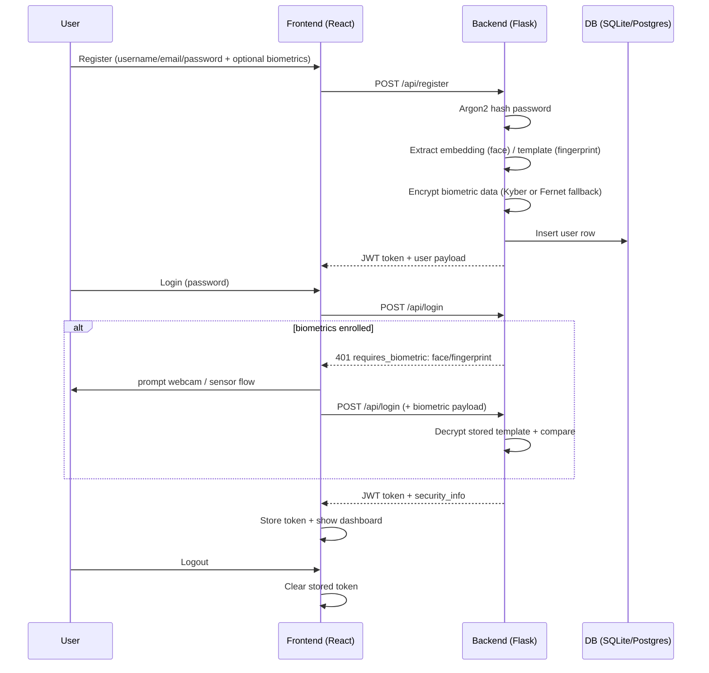
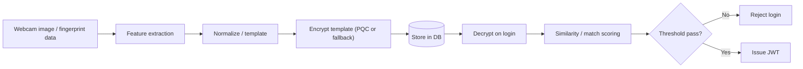

## Architecture (Quantum-Inspired Authentication)

### System Overview

This project implements a full-stack, quantum-inspired authentication system. It bridges traditional web security with forward-looking cryptographic concepts, specifically focusing on biometric verification secured by Post-Quantum Cryptography (PQC) and Quantum Random Number Generation (QRNG).

- **Frontend**: React (manages routing, JWT-based auth context, and the webcam capture UX for biometrics)
- **Backend**: Flask (handles JWT auth generation, biometric feature extraction/verification, and PQC/QRNG logic)
- **Storage**: SQLAlchemy models with SQLite/Postgres (stores users, hashed passwords, and encrypted WebAuthn/biometric templates)
- **Security**: Argon2id password hashing, encrypted biometric templates, stateless JWT sessions, and Kyber KEM encryption.

---

### Holistic System Architecture

The following diagram illustrates how the frontend, backend, database, and quantum-safe security core interact with one another:

```mermaid
flowchart TD
  %% Styling definitions
  classDef frontend fill:#61DAFB,stroke:#333,stroke-width:2px,color:#000
  classDef backend fill:#4B8BBE,stroke:#333,stroke-width:2px,color:#fff
  classDef db fill:#336791,stroke:#333,stroke-width:2px,color:#fff
  classDef crypto fill:#F2C811,stroke:#333,stroke-width:2px,color:#000
  classDef userNode fill:#FF9900,stroke:#333,stroke-width:2px,color:#000

  %% External Actors
  U(("👤 User")):::userNode

  %% Frontend Layer
  subgraph Frontend ["🖥️ Frontend (React)"]
    UI["Routing & UI\n(Tailwind)"]:::frontend
    AuthCtx["Auth Context\n(JWT Sessions)"]:::frontend
    BioCapture["Biometric Capture\n(Webcam UX)"]:::frontend
    
    UI <--> AuthCtx
    UI <--> BioCapture
  end

  %% Backend Layer
  subgraph Backend ["⚙️ Backend API (Flask)"]
    Router["API Endpoints\n(/api/login, /api/register)"]:::backend
    AuthLogic["Auth Manager\n(Argon2id Hashing, JWT)"]:::backend
    BioProcessor["Biometric Processor\n(Extraction & Matching)"]:::backend

    subgraph SecurityCore ["🔐 Quantum-Safe Core"]
      PQC["Kyber KEM\n(or Fernet Fallback)"]:::crypto
      QRNG["ANU QRNG\n(or Secrets Fallback)"]:::crypto
    end
    
    Router --> AuthLogic
    Router --> BioProcessor
    
    BioProcessor <-->|Encrypt/Decrypt| PQC
    AuthLogic <-->|Entropy for Keys| QRNG
  end

  %% Storage Layer
  subgraph Storage ["🗄️ Database (SQLAlchemy)"]
    DB[("SQLite / Postgres\n(Users + Encrypted Biometrics)")]:::db
  end

  %% Inter-component flows
  U -->|Interacts| UI
  U -->|Provides Face/Fingerprint| BioCapture
  
  UI -->|HTTP POST JSON| Router
  BioCapture -->|Biometric Payload| Router
  
  Router -.->|Returns JWT / 401 Challenge| AuthCtx
  
  AuthLogic <-->|Read/Write User Row| DB
  PQC <-->|Store/Retrieve Templates| DB
```

---

### Authentication Flow (Register → Login → Logout)

The authentication process utilizes a multi-step flow. If a user has enrolled in biometrics, the backend issues a `401 Unauthorized` challenge during a standard password login, prompting the frontend to capture and submit biometric data before issuing the final session token.

```mermaid
sequenceDiagram
  participant U as User
  participant FE as Frontend (React)
  participant BE as Backend (Flask)
  participant DB as DB (SQLite/Postgres)

  U->>FE: Register (username/email/password + optional biometrics)
  FE->>BE: POST /api/register
  BE->>BE: Argon2 hash password
  BE->>BE: Extract embedding (face) / template (fingerprint)
  BE->>BE: Encrypt biometric data (Kyber or Fernet fallback)
  BE->>DB: Insert user row
  BE-->>FE: JWT token + user payload

  U->>FE: Login (password)
  FE->>BE: POST /api/login
  alt biometrics enrolled
    BE-->>FE: 401 requires_biometric: face/fingerprint
    FE->>U: prompt webcam / sensor flow
    FE->>BE: POST /api/login (+ biometric payload)
    BE->>BE: Decrypt stored template + compare
  end
  BE-->>FE: JWT token + security_info
  FE->>FE: Store token + show dashboard

  U->>FE: Logout
  FE->>FE: Clear stored token
```

---

### Biometric Enrollment & Verification Pipeline

Biometric data is never stored in plaintext. Raw images or sensor data are immediately converted to mathematical features, normalized, and then heavily encrypted before touching the database.

```mermaid
flowchart LR
  A[Webcam image / fingerprint data] --> B[Feature extraction]
  B --> C[Normalize / template]
  C --> D["Encrypt template (PQC or fallback)"]
  D --> E[(Store in DB)]
  E --> F[Decrypt on login]
  F --> G[Similarity / match scoring]
  G --> H{Threshold pass?}
  H -- No --> I[Reject login]
  H -- Yes --> J[Issue JWT]
```

---

### PQC / QRNG Usage

A major differentiator of this architecture is the integration of quantum-safe mechanics:

- **PQC (Kyber KEM)**: Used to protect the encryption keys that secure the biometric templates in the database. This protects against "harvest now, decrypt later" attacks by future quantum computers. If Kyber is unavailable in the host environment, the system gracefully falls back to standard AES (Fernet).
- **QRNG**: The system pulls true quantum entropy from the ANU QRNG API for cryptographic operations. If the API is unreachable, it falls back to Python's cryptographically secure pseudo-random number generator (`secrets`).
- **Why fallback exists**: To ensure the application remains portable, demo-friendly, and runnable on typical local development machines while still demonstrating enterprise-grade architectural decision points.

---

### Design Choices (Portfolio Perspective)

- **JWT (JSON Web Tokens)**: Provides straightforward, stateless sessions that are easy to demonstrate with a frontend dashboard and protected API routes.
- **Argon2id**: Utilizes the modern, memory-hard password hashing standard recommended by OWASP, resisting GPU brute-force attacks.
- **Encrypted Biometrics**: Demonstrates a deep understanding of data privacy. By never storing raw biometrics, the architecture aligns with strict compliance frameworks (e.g., GDPR, CCPA).
- **Configurable Thresholds**: The biometric similarity scoring relies on configurable thresholds, showcasing the ability to tune risk (balancing false-acceptance vs. false-rejection rates) based on security needs.
